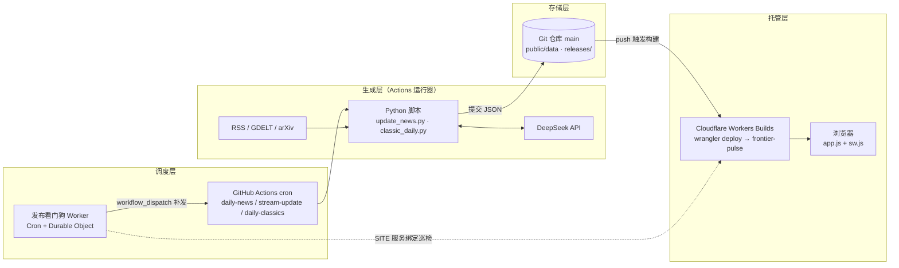
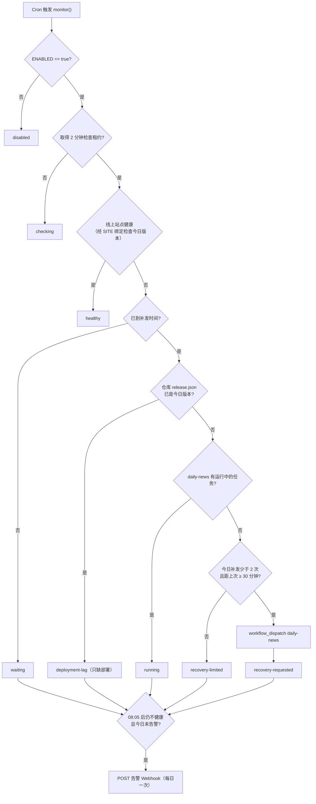

# NewsFrontier（智域前沿）技术手册

> 整理日期：2026-10-09，基于当日 `main` 分支（含 #65–#69）。在线协作版本与本文件内容一致，后续以仓库文件为准随代码更新。

## 1. 项目概述

智域前沿（Frontier Pulse，正式站点 [newsfrontier.top](https://newsfrontier.top)）是一个**无服务器、以 Git 为数据库**的中文前沿情报站：GitHub Actions 定时运行 Python 脚本采集全球 RSS/GDELT 与 arXiv，经规则评分与 DeepSeek 编辑生成静态 JSON，提交回 `main` 后由 Cloudflare Workers 静态资源托管发布。整个系统没有常驻后端、没有数据库服务，浏览器直接读取 JSON 渲染页面。

### 1.1 面向读者的五个栏目

| 栏目 | 内容 | 更新节奏 | 主要数据文件 |
| --- | --- | --- | --- |
| 今日 Top 10（日报） | AI 评分 + 规则约束选出的 10 条中文简报 | 每日 08:00（北京时间） | `data/news.json` |
| 全量动态 | 严格 24 小时内最多 300 条合格候选 | 每 3 小时 | `data/stream.json` |
| 每日深读 | 4～6 项核心事件的主题长文 | 随日报 | `data/deepread.json` |
| 论文雷达 | arXiv 近 7 天论文与中文编辑 | 随日报 | `data/research.json` |
| 经典论文 | 200 篇经典论文的每日轮换推荐与中文导读 | 每日 07:11 触发 | `classics/release.json` |

此外还有历史归档与跨日搜索、事件时间线、周报、异常信号、收藏/关注（仅存浏览器）、Atom 订阅和管理员邮件摘要。

### 1.2 贯穿全项目的设计原则

- **宁缺毋假**：候选不足 10 条或校验失败时保留上一期并公开失败原因，绝不生成虚构新闻或硬编码样例。
- **程序锁定事实，AI 只做编辑**：事件 ID、来源、链接、配图、证据等级由程序固定；模型只能在给定证据内评分、翻译、总结。
- **先暂存、后校验、再原子发布**：生成写入临时目录，校验通过才晋升为正式版本并写入不可变快照，可一键恢复。
- **新闻与经典论文隔离**：两条产线各自拥有文件、快照和工作流，互不覆盖。
- **准时与幂等**：Cloudflare 看门狗准点触发，工作流自带门禁防止重复出刊。

### 1.3 如何阅读本手册

第 2～3 章建立全局认识；第 4 章按时间顺序讲清每天发生什么；第 5～6 章深入后端脚本与前端代码；第 7～8 章讲数据格式和上线运维；第 9～10 章面向要动手修改的开发者。代码路径均相对仓库根目录，内容基于 2026-10-09 的 `main`（最新合并 #69）。

## 2. 技术栈与仓库结构

技术栈故意保持极简：后端只用 Python 3.11+ 标准库（CI 固定 3.12，无 `pip install`），前端是无构建步骤的原生 JavaScript，部署只有 `npx wrangler deploy` 一条路径。

### 2.1 技术选型

| 层 | 技术 | 说明 |
| --- | --- | --- |
| 数据生产 | Python 3.12 标准库（`urllib`、`xml.etree`、`concurrent.futures`、`zoneinfo`） | 无第三方依赖，Actions 上免安装即跑 |
| 大模型 | DeepSeek `deepseek-v4-flash`（默认），OpenAI Responses（可选） | JSON 结构化输出，关闭思考模式；无密钥时退回规则模式 |
| 调度 | GitHub Actions（7 个工作流）+ Cloudflare Cron | 看门狗准点触发，GitHub 定时任务兆底 |
| 存储 | Git 仓库中的 JSON 文件 | `public/data`、`public/releases`、`public/classics` |
| 托管 | Cloudflare Workers 静态资源（Worker `frontier-pulse`） | 由 `public/_headers` 下发安全头与缓存头 |
| 看门狗 | Cloudflare Worker + Durable Object（SQLite） | `ops/watchdog/worker.mjs`，保存每日重试与告警状态 |
| 前端 | 原生 JS 单页 + Service Worker | 无框架、无打包；CSP 严格禁止外链脚本 |
| 测试 | `unittest`、`node --test`（Node ≥ 24）、Playwright 1.62.1 | Python 离线测试 + 客户端单测 + 浏览器回归 |
| 外部数据源 | 60 个 RSS/Atom 入口（51 个域名）、GDELT DOC API、arXiv API | 配置在 `config/news_config.json` |

### 2.2 目录地图

```text
frontier-pulse/
├─ scripts/                数据生产与发布（约 1.3 万行 Python）
│  ├─ update_news.py       主管线：采集、评分、AI 选稿/翻译、历史、归档、状态（5136 行）
│  ├─ news_evidence.py     原文段落相关性筛选
│  ├─ event_identity.py    跨日事件身份 eventId
│  ├─ evidence_trace.py    译文/深读的证据追溯校验
│  ├─ reader_quality.py    正文事件准入与中文可读性
│  ├─ deepread_*.py        每日深读：选题、写作、质量门禁
│  ├─ daily_deepread.py    深读 v1 与候选证据工具
│  ├─ recover_deepread.py  深读独立恢复
│  ├─ publication.py       暂存/校验/晋升/快照/恢复/清理
│  ├─ publication_clock.py 08:00 发布时钟
│  ├─ news_boundary.py     新闻文件所有权与路径安全
│  ├─ check_daily_refresh.py 日报是否需要运行的门禁
│  ├─ classic_*.py · publish_classics.py  经典论文目录、导读、轮换与发布
│  ├─ send_digest.py · wechat_export.py   邮件与公众号导出
│  └─ audit_sources.py · check_production.py  信源审计与线上验收
├─ config/
│  ├─ news_config.json     主题、信源、权重、配额、模型、各类阈值
│  └─ deepread_storylines.json 深读长期议题
├─ public/                 站点根目录（即 Worker 静态资源）
│  ├─ index.html · sw.js · feed.xml · _headers · .assetsignore
│  ├─ assets/              app.js（2669 行）、styles.css、classic-*.js、publication-client.js、news-policy.json
│  ├─ data/                当前生效的新闻数据（release.json 指向当前快照）
│  ├─ releases/r…/         不可变完整快照（最多 7 个）
│  └─ classics/            经典论文发布清单与快照
├─ research/               经典论文输入：目录、导读、冻结队列（新闻管线禁止进入）
├─ ops/watchdog/           发布看门狗 Worker
├─ .github/workflows/      7 个工作流
├─ tests/                  Python/Node/浏览器测试与固定样例
├─ docs/                   设计文档、审计与验收记录
├─ legacy-offline/         早期离线样例（生产不使用）
└─ wrangler.jsonc          站点 Worker 部署配置
```

代码体量集中在两个大文件：`scripts/update_news.py`（5136 行、约 150 个函数）和 `public/assets/app.js`（2669 行）。学习时建议先读 `main()` 与工作流 YAML，再按第 5 章的顺序深入函数。

## 3. 系统总体架构

系统的核心思想是“**计算在 CI，状态在 Git，分发在边缘**”：所有重活（采集、调用大模型、校验）都在 GitHub Actions 的临时运行器里完成，结果以 JSON 提交到 `main`，Cloudflare 把 `public/` 原样发布到边缘节点。



实线是数据流，虚线是看门狗经 Cloudflare 服务绑定对线上站点的巡检；Git 仓库是唯一的状态中心。

### 3.1 四层分工

| 层 | 组件 | 职责 | 关键文件 |
| --- | --- | --- | --- |
| 调度层 | 看门狗 Worker、GitHub `schedule` | 准点触发、失败重试、延迟告警 | `ops/watchdog/worker.mjs`、`.github/workflows/*.yml` |
| 生成层 | Python 脚本 | 采集→评分→AI 编辑→事件身份→深读→写入暂存目录 | `scripts/update_news.py` 等 |
| 发布层 | `publication.py` + Git | 校验、生成不可变快照、原子安装、提交推送 | `public/data/release.json`、`public/releases/` |
| 展示层 | Cloudflare Worker + 浏览器 | 静态托管、安全头、客户端渲染与离线缓存 | `public/_headers`、`public/assets/app.js`、`public/sw.js` |

### 3.2 关键架构决策

- **为什么用 Git 当数据库**：零运维成本；每次发布都是一个可审计的提交；回滚就是恢复文件。代价是仓库体积增长，因此快照限 7 个，大文件 `events.json` 由 `.assetsignore` 排除在部署之外。
- **为什么要看门狗**：GitHub `schedule` 不保证准点，2026 年 9–10 月 07:40 的任务实际在 09:50–10:55 才启动；`workflow_dispatch` 通常一分钟内开始。
- **为什么共用一个并发组**：四个数据工作流都写 `main`，`concurrency: frontier-data-main` + `queue: max` 让它们排队串行，避免互相覆盖；推送时再用 `rebase` + 最多 3 次重试，冲突则失败关闭，绝不强推旧数据。
- **为什么站点没有 Worker 脚本**：`wrangler.jsonc` 只声明 `assets.directory: public`，安全头与缓存头由 `_headers` 下发，没有任何服务端代码可以被攻击。
- **密钥只在 Actions**：`DEEPSEEK_API_KEY`、SMTP 凭证只存在 GitHub Secrets；看门狗的 `GITHUB_TOKEN` 是仅有 `Actions: Read and write` 的细粒度令牌；前端不含任何密钥。
- **新闻与经典论文双向隔离**：`news_boundary.py` 的 `safe_path()` 禁止新闻管线写入 `classics/`、`research/` 或 `research.json`；经典论文工作流也只 `git add public/classics`。

## 4. 核心工作流程

一天的生产节奏由四条数据工作流组成：经典论文 07:11 先发，日报 07:41 开始生成、等到 08:00 整点发布，深读在日报之后独立补写，全量动态全天每 3 小时刷新一次。下文时间均为北京时间。

### 4.1 一天的时间表

| 时间 | 触发方 | 动作 |
| --- | --- | --- |
| 每 3 小时第 17 分（00:17、03:17…） | GitHub schedule | `stream-update.yml` 刷新 24 小时全量动态 |
| 07:10 / 07:11 | GitHub schedule / 看门狗 | `daily-classics.yml` 从离线库存发布当日经典论文 |
| 07:40 | 工作流门禁 | `check_daily_refresh.py` 在 07:40（460 分钟）前一律跳过 |
| 07:41 | 看门狗 | 线上不是今天的版本且无运行中任务 → `workflow_dispatch` 触发日报 |
| 07:50 | GitHub schedule | `production-smoke.yml` 检查线上安全头与缓存头 |
| 08:00 | 日报任务内 | `publication_clock.py --wait` 等到整点后晋升发布 |
| 08:05 | 看门狗 | 仍未发布且配置了 `ALERT_WEBHOOK_URL` → 发告警 |
| 08:15 | 看门狗 | 首次运行失败 → 再触发一次（每天最多 2 次，间隔 ≥ 30 分钟） |
| 日报完成后、08:30、09:00、09:45 | `workflow_run` / schedule | `deepread-recovery.yml` 只补写未完成的深读主题 |
| 07:40 / 08:10 | GitHub schedule | 日报兆底定时（实际常晚 2～3 小时，靠门禁保证幂等） |

### 4.2 日报工作流（daily-news.yml）逐步解析

1. **刷新门禁**：`check_daily_refresh.py` 读 `status.json`、`release.json`、`deepread.json`，输出 `should_run` 与 `edition_date`。当天已有正式版本则跳过（除非手动填写更正原因）；07:40 前跳过；健康版本只因 schema 11 / 摘要修订 5 / 历史分析缺失而重跑，深读不完整交给恢复工作流而不重跑日报。
2. **离线单测**：`tests/run_offline.py`，任何测试失败都会阻止发布。
3. **准备暂存目录**：`publication.py prepare` 把当前 `public/` 里新闻管线拥有的文件复制到 `$RUNNER_TEMP/frontier-stage`，生成只写这里。
4. **采集与生成**：`update_news.py` 写出 news / archive / stream / events / weekly / signals / deepread / feed / status 全部产物（步骤设 `continue-on-error`，失败交给后续步骤记录）。
5. **发布前校验**：`publication.py validate --mode daily` 检查 10 条、schema、日期、事件引用、译文计数、深读引用一致性等（见 5.8）。
6. **等待与晋升**：`publication_clock.py --wait` 最多等 30 分钟到 08:00；`publication.py promote` 生成新 `releaseId`（形如 `r20261008T055334-3a70ddff`）、写快照、原子安装、清理旧快照。
7. **失败记录**：未晋升时 `publication.py fail` 只更新 `status.json`，上一期内容原样保留。
8. **提交推送**：成功则 `git add public/data public/releases public/feed.xml`，失败只提交 `status.json`；`rebase` 冲突即失败，推送最多重试 3 次。
9. **邮件摘要**：发布且推送成功、非 `push` 事件触发时，`send_digest.py` 通过 SMTP 密送给管理员列表（未配置则安全跳过）。

这个工作流还在代码发布时自动触发（`push` 到 `main` 且改动了生成相关脚本或配置），但门禁保证已发布的当日版本不会被重做，也不会重发邮件。

### 4.3 update\_news.py 的主管线（main 函数）

1. **前置安全检查** `preflight_news_outputs()`：在写任何文件前盘点所有输出路径，拒绝符号链接、硬链接、输入输出重叠和越界路径。
2. **幂等判断**：当天已有 `releaseId` 且无更正原因，直接退出。
3. **采集** `collect_rss()` + `collect_gdelt()`（或 `--fixture`），并用 `audit_sources.summarize_coverage()` 写 `source-health.json`。
4. **候选排序** `rank_candidates()` = 时间窗过滤 → 选题政策过滤 → 去重合并 → 规则评分。
5. **韧性补充**：合并 8 小时内的已验证动态缓存；不足 10 条时按 36/48/72 小时逐级补充并降权。
6. **正文补强** `enrich_article_descriptions()`：对短导语抓取公开正文段落（每轮最多 120 条），由 `news_evidence.py` 筛选相关段落。
7. **日报组稿** `build_report()`：准入 → 事件合并 → 72 条均衡短名单 → AI 评分 → 65/35 融合 → 多样性约束 → 中文编辑 → 历史关联分析。
8. **全量动态** `build_stream_report()`：复用未变化译文，在预算内补译新条目。
9. **事件身份与情报** `assign_event_ids()` → `build_event_registry()` → 周报 `build_weekly_digest()` → 异常信号 `build_anomaly_signals()` → 首屏三条 `choose_spotlight_items()`。
10. **每日深读** `build_daily_deepread()` → `choose_readable_deepread()`（不合格则保留上一篇可读版本）。
11. **写出**：归档、搜索分片、news、stream、deepread、events、weekly、signals、Atom feed、status；任何异常只写失败状态并返回 2。

`--stream-only` 模式（全量动态工作流使用）跳过第 7、10 步，只更新 stream / stream-status / events / source-health 四个文件。

### 4.4 其他工作流

| 工作流 | 触发 | 写入范围 | 要点 |
| --- | --- | --- | --- |
| `stream-update.yml` | 每 3 小时、相关脚本 push | stream / stream-status / events / source-health | 校验模式 `--mode stream`，不生成快照 |
| `deepread-recovery.yml` | 日报完成后、08:30/09:00/09:45 | data / releases / feed | 只补写深读，审核不得改变日报选稿，以“当日更正”形式发布新快照 |
| `daily-classics.yml` | 07:10、看门狗 07:11 | `public/classics` | 确定性轮换，不调用模型 |
| `restore-release.yml` | 手动（输入 `release_id`） | data / feed | 校验快照哈希后恢复 |
| `production-smoke.yml` | 07:50、手动 | 无 | `check_production.py` 验收 CSP、nosniff、缓存头、Feed |
| `ci.yml` | push / PR | 无 | 离线单测、Node 测试、样例版构建、邮件渲染、Playwright 浏览器回归 |

## 5. 核心模块代码分析

本章按数据流经的顺序讲解每个模块：采集 → 去重与分类 → 评分 → 选稿 → AI 编辑 → 事件身份 → 情报衍生 → 深读 → 发布。函数名均可在对应文件中直接搜索。

### 5.1 数据模型：Article 与 ResearchPaper

`update_news.py` 开头用 `@dataclass` 定义内存模型。`Article` 的关键字段：`id`（`article_id(url, title)` 的哈希）、`url`（经 `canonical_url()` 清洗追踪参数）、`published_at` 与 `date_estimated`（日期无法解析时取窗口边缘并降权）、`category`/`tags`、`raw_score`/`score_components`/`score_reasons`（可解释评分）、`evidence_sources`/`source_evidence`（合并后的多来源与正文证据）、`corroboration`（独立来源数）。生成输出时由 `item_from_article()` 转成前端使用的 JSON 条目。

### 5.2 采集层

- `collect_rss()`：`ThreadPoolExecutor` 最多 8 线程并行读取 60 个入口；单个 feed 超时 18 秒、最大 3 MB、重试 2 次，每源最多取 150 条（可配 `max_entries`）。同时处理 RSS `item` 与 Atom `entry`，只认 `pubDate/published/date`，不把 `updated` 当发布时间。每个源写一条诊断记录，汇总进 `source-health.json`。
- `collect_gdelt()`：按 `config.categories[*].query` 查询 GDELT DOC API，补充只有标题链接的新闻。
- `collect_public_cache()`：把上一次已发布的 `stream.json`/`news.json` 反序列化为 `Article`，用于信源短暂中断时保底。
- `enrich_article_descriptions()` + `news_evidence.select_relevant_evidence()`：对导语太短的条目抓取原文页，用自写的 `HTMLParser` 跳过 nav/aside/footer 与广告、付费墙区块，分别比较 HTML 与 JSON-LD 正文候选，按“标题主体 + 动作”筛出相关段落，预算 6000 字符。当页面出现冲突标题时否决整个正文，避免把相邻新闻混进来。正文只用于当轮编辑，不镜像到站点。

### 5.3 去重、分类与选题政策

- `eligible_articles()` / `news_subject_excluded()`：应用 `public/assets/news-policy.json`（前后端共用），按标题与导语中的中英文实体排除“以中国及中国机构为主要对象”的新闻。
- `deduplicate()`：按时间倒序遍历，只有与组内**所有**成员都满足 `event_identity.same_event()` 才入组，合并时把来源并入代表条目。`wire_family()`/`source_group()` 把 Reuters/AP 通稿转载折算为同一证据网络，不虚增“独立来源”。
- `classify()`：对 6 个类别（AI、航空航天、军事动态、局部冲突、前沿技术、无人系统）打分：命中词 ×3 + 标题命中 ×3 + 专业源加成 6 + 默认类别 2。`topical_hits()` 对 `launch`、`strike`、`chip` 等歧义词要求上下文词同时出现，并先剔除 heart attack、potato chip、labor strike 等日常短语。
- `reader_quality.assess_admissibility()`：日报准入闸门，拒绝只有标题、直播容器、周报综述、问答、历史专栏、软文广告，只让有正文证据（`body`）的事件入选。

### 5.4 规则评分（score\_articles）

每条候选得到一个 0～100 的可解释规则分，各分项写入 `score_components`：

| 分项 | 取值 | 说明 |
| --- | --- | --- |
| 基础分 | 15 | 固定 |
| 来源 | ≤ 20 | `source_weights` 域名权重 → feed 权重 → `.gov/.mil` 18 → 默认 10，取所有合并来源最大值 |
| 主题优先级 | 8～10 | `categories[*].priority` |
| 时效 | 0～20 | 20 − 0.5 × 发布小时数 |
| 影响信号 | ≤ 22 | `impact_keywords` 命中权重之和 |
| 主题相关性 | ≤ 12 | 每个主题命中词 2 分 |
| 证据完整度 | 2 / 3 | 导语 ≥ 80 字符得 3 |
| 多源印证 | ≤ 12 | (独立来源数 − 1) × 4 |
| 编辑降权 | −(≤ 24) | `editorial_penalty_keywords` 每词 12 |
| 日期异常降权 | −7 | 发布时间不可解析 |
| 补充窗口降权 | −(4～18) | 超过 24 小时的补充候选，每多 12 小时加 3 |

命中 `editorial_exclude_keywords` 或没有任何主题命中的条目直接丢弃。

### 5.5 选稿：AI 评分 + 程序约束（build\_report）

1. 准入过滤后按 `eventId` 分组，每组取证据最多的一条作代表。
2. `balanced_shortlist()` 保留 72 条（`candidate_limit`），先为每个类别预留名额，避免高分安全新闻把科技新闻挤出短名单。
3. `ai_select()` 让模型只输出 `{index, score}`（0～100），明确告诉模型“不要为配额改分”。失败重试一次，仍失败则 `selectionStatus=fallback`，用纯规则排序。
4. 融合分数（`ai_selection_weight` 默认 0.65）：

```latex
S_{final} = \operatorname{round}\left(0.65 \cdot S_{AI} + 0.35 \cdot S_{rule}\right)
```

5. `choose_diverse()` 分四轮填满 10 条：先为 AI、航空航天、无人系统、前沿技术各预留 1 席；第 1 轮同时遵守每类 ≤ 3、每域名 ≤ 2、军事+冲突合计 ≤ 4；第 2 轮放宽类别；第 3 轮放宽来源；最后才放宽安全配额。每次放宽都写 `selection_note`，页面和状态文件公开说明。
6. 状态语义：`ok`（无调整）、`adjusted`（程序为配额换位，正常）、`relaxed`（放宽了配额）、`fallback`（AI 评分失败）。`selectionDiagnostics.unconstrainedTop/finalTop/adjustedInIds/adjustedOutIds` 记录约束前后差异。

### 5.6 AI 调用层

- `resolve_ai_runtime()`：`AI_PROVIDER=auto` 时优先 DeepSeek，只有没有 DeepSeek 密钥才用 OpenAI；一次失败不跨供应商重试。
- `request_structured_json()`：DeepSeek 走 Chat Completions（`response_format: json_object`、`thinking: disabled`，schema 与示例拼进 system prompt）；OpenAI 走 Responses（`json_schema strict`、`store: false`）。返回后一律本地解析校验。
- `run_resilient_ai_batches()`：通用批处理器。新闻每批 5～6 条、论文每批 5 篇；批次失败或缺项时**只拆分重试缺失 ID**；连续失败触发熔断，剩余条目记为 `not_attempted_after_circuit_breaker`。诊断信息（请求数、重试数、缺失原因）写入 status，但绝不包含密钥或提示词。
- 译文复用：`reusable_stream_translations()` 在提供方、模型、`SUMMARY_REVISION`（当前 5）、`summary_input_hash()` 都未变时直接复用旧译文，控制成本。
- 译文守门：`evidence_trace.valid_display_translation()` 检查译文中的数字、否定、范围限定是否与原文一致；不通过时回退到原文摘录，而不是采用模型总结。

### 5.7 事件身份与情报衍生

`event_identity.py` 是全项目最保守的模块：“缺少证据就是不同事件”。`_match()` 的判定顺序：

1. 相同新闻 ID 或相同规范链接 → 同一事件。
2. 一票否决：相隔 > 30 天；计划/延迟/取消等状态不同；地点、主体、对象、型号编号、缩写、事件日期任一冲突；一方含否认词另一方不含。
3. 需要“锚点”：共同的具体对象（排除 Starship、GPT 等泛称）、带编号的对象、≥ 2 个共同锚词等。
4. 需要共同动作（launch、attack、acquire…）；跨日匹配还需后一条带后续报道标记，且一般不超过 7 天。

`assign_event_ids()` 用事件库中的新闻 ID、URL 索引和最多 8 条代表样本复用旧 `evt-xxxxxxxxxxxx`，产出的 ID 在日报与全量动态之间共享。在此基础上：

- `build_event_registry()`：事件档案（首次/最近观测、阶段、时间线、来源网络），保留 365 天，写 `events.json`（约 6 MB，不部署到站点）。
- `build_history_contexts()` + `history_association_score()`：用标题/正文/标签的重叠系数算历史关联分（类别本身不能建立关联），阈值 30、最多 3 条；模型只能总结程序给定的历史候选。
- `build_evidence_matrix()` / `build_forecast_entries()`：证据/争议矩阵与带到期日的预判台账。
- `build_weekly_digest()`：每周收敛 5～8 条事件线。
- `build_anomaly_signals()`：以近 30 个归档日的中位数 + MAD 为稳健基线，同时满足倒数 ≥ 1.8、增量 ≥ 1.5、稳健偏离 ≥ 1.5、独立来源 ≥ 2 才标记升温。

```latex
z_{robust} = \frac{x - \operatorname{median}}{\max(1,\ 1.4826 \cdot \mathrm{MAD})}
```

### 5.8 每日深读（修订 13）

入口是 `deepread_editorial.build_daily_deepread()`，实际转到 `deepread_topics.build_topic_deepread()`。流程是“编辑部”式的三层把关：

1. **候选** `prepare_candidates()`：从 24 小时内最多 12 项独立事件中排除政治政策、观点、活动等体裁（`deepread_editorial_signals.is_political_policy()`、`excluded_genre()`），为每条附上证据等级（primary/multi/single/opinion）、项目键 `projectKeys`、长期议题 `storylines`（`config/deepread_storylines.json`）与已捕获历史。
2. **选题** `_plan()`：模型作“主编”，提出 1～3 个主题、合计 ≤ 6 件事件；只有 `projectKeys` 或 `comparisonKeys` 确有交集的事件才能合成一章，每类最多一个主题，有 AI/前沿技术候选时必须选一篇。失败退回 `_fallback_topics()`（每类取一条）。
3. **写作** `_write_and_check()`：主篇 800～1500 字、其余 300～500 字；模型输出结构化 `blocks`，每句必须引用 1～3 个 `evidenceId`；事实段（paragraph/background/change）与分析段（analysis/comparison/watch）分开。
4. **校对** `_review()`：先跑廉价的本地规则 `deepread_topic_quality.rule_issue()`（数字、限定语 planned/limited/simulation、新增数量等），再让模型以“独立校对”身份逐句判 supported/partial/unsupported，并做整章 `editorialReview`（是否有判断、机制、比较、观察点）。
5. **修复与挽救**：第一稿不过则把具体问题作为 `validationFeedback` 重写；第二稿若只是个别句子不过，删去这些句子再校一次（`salvaged`）；仍不过则该主题失败。
6. **可读性选择** `deepread_quality.choose_readable_deepread()`：本期至少有可读章节则发布（`complete`/`partial`），否则保留上一篇合格文章（`retained`）。
7. **恢复** `recover_deepread.py`：读取当日初版快照的证据（不让后来更新的动态污染素材），复用已通过的章节与 `topicPlan`，只重写失败主题，校验日报选稿未变后以“当日更正”发布新快照。

PR #65 加入了 storylines、允许有依据的因果分析，以及 `wechat_export.py`（把深读 JSON 导出为公众号草稿）。编辑契约见 `docs/deepread-editorial-contract.md`。

### 5.9 发布层（publication.py）

子命令：`prepare`、`validate`、`promote`、`fail`、`restore`、`prune`。核心机制：

- **文件所有权**：`news_boundary.owns()` 用白名单定义新闻管线拥有的文件（`data/` 下 9 个顶层文件、日期归档、周报、搜索分片、`feed.xml`）；`safe_path()` 拒绝符号链接、硬链接、越界和进入论文命名空间。
- **校验** `_validate()`：动态流非空且每条都能在事件库找到；日报恰好 10 条、schema 11、时区 `Asia/Shanghai`、摘要修订 5、每条有 keyFacts/sources/eventDossier/evidenceMatrix/historyContext、译文与历史计数一致、首屏 3 条引用有效、中文可读；深读事件 ≤ 6、不重复、章节引用与事件一一对应。
- **晋升** `_promote()`：在 `releases/.building-*` 临时目录组装快照 → 给每个文件写入 `releaseId` → 生成 `edition-versions/<id>.json`（紧凑版，快照过期后旧链接仍可打开）→ `manifest.json` 记录每个文件 SHA-256 → `os.replace` 原子改名 → `verify_snapshot()` → `install_bundle()` 安装到 `public/data`，**`release.json` 最后写入**作为提交点；安装中途失败按事前快照回滚。
- **不可变与更正**：同一天已有正式版时只接受带原因（4～220 字）且 `base_release_id` 等于当前版本的更正（compare-and-swap），并记录 `revision.changes` 的增删改差异；不允许用旧日期覆盖新日期。
- **并发保护**：`publication_lock()` 用 `fcntl.flock` 文件锁；深读恢复用 `stream_hashes()` 确认动态文件在恢复期间未被修改。
- **保留策略** `prune_snapshots()`：最多 7 个完整快照，始终保留当前版及其初版、上一版；无法校验的“外来”目录不删。

### 5.10 经典论文子系统

完全离线、确定性，不调用模型。`classic_catalog.py` 校验 200 篇目录（AI、SLAM、GNC、CV、UAV 各 40 篇，每篇需书目证据 + 至少两个独立“经典性”依据）；`classic_guides.py` 管理 30 篇中文全文导读；`classic_papers.py` 实现轮换规则 `classic-calendar-v1`：以 2026-09-30 为锚点按 5 天周期轮换领域对 `rotation_domains()`，同一篇论文间隔 ≥ 90 天 `repeat_allowed()`；`load_ready_pool()` 用 `research/classic-publishing/frozen-catalog.json` 的哈希锁定目录字节。`classic_publication.py` 用内容哈希命名快照 `c-<sha256>`，`public/classics/release.json` 是唯一提交点。当天没有库存时发布 `published-pending` 状态而不是重复或编造。

## 6. 前端站点

前端是一个无框架、无构建的单页应用：`index.html` 加载一份样式和几个 IIFE 脚本，所有内容都来自同源 JSON，由 `app.js` 在浏览器里渲染。CSP 为 `script-src 'self'`，因此不允许内联脚本和外链脚本。

### 6.1 文件分工

| 文件 | 行数 | 职责 |
| --- | --- | --- |
| `public/index.html` | — | 页面骨架、导航七个视图、OG/Twitter 元数据、预加载 `release.json` 与 `news-policy.json` |
| `assets/app.js` | 2669 | 主应用：视图切换、数据加载、归一化、渲染、搜索、收藏、关注、告警 |
| `assets/publication-client.js` | 61 | 与 DOM 无关的发布契约：北京时钟、日期格式、清单校验、快照路径解析（Node 测试也复用） |
| `assets/classic-*.js` | 约 1200 | 经典论文视图：清单哈希校验、导读渲染、中文题名、与近期新闻关联 |
| `assets/styles.css` | 807 | 响应式样式与深色主题 |
| `sw.js` | 83 | Service Worker：离线回退 |
| `assets/news-policy.json` | — | 选题排除规则，前后端共用 |

### 6.2 启动与版本钉住

1. `init()` 应用主题、注册 `sw.js`，按 URL 参数 `?view=` / `?date=` 进入对应视图。
2. `ensureNewsContext()` **并行**拉取 `news-policy.json` 与发布清单，再并行拉取当期日报与归档索引（PR #63 的优化）；经典论文上下文在后台加载，不阻塞新闻首屏。
3. `loadPublication()` 读 `data/release.json`，用 `FrontierPublication.validateManifest()` 校验。之后所有新闻数据都经 `fetchPublicationJson()` 的 `resolve()` 改写到 `./releases/<releaseId>/data/...`，这就是“版本钉住”：同一次浏览读到的日报、深读、归档一定来自同一快照，不会出现半新半旧。
4. 读到的内容用 `accepts()` 核对 `releaseId`/`editionDate`，不一致就报“内容版本与发布清单不一致”。
5. 分享链接带 `release=<id>` 时，先尝试完整快照，快照已被清理则回退到 `data/edition-versions/<id>.json` 紧凑版，保证旧链接长期可用。

### 6.3 七个视图

| 视图 | `view` 参数 | 数据 | 要点 |
| --- | --- | --- | --- |
| 今日简报 | `latest` | `news.json` | 首屏 `spotlightIds` 三条 → 执行摘要 → Top 10；事件时间线默认折叠 |
| 每日深读 | `deepread` | `deepread.json`、`deepread/index.json` | 兼容 v1、v2 与修订 13 主题版；编辑分段标注“编辑分析” |
| 全量动态 | `stream` | `stream.json` | 按 6/12/24 小时、来源、主题、关键词筛选，每页 24 条分页渲染 |
| 每日经典论文 | `research` | `classics/release.json` → 快照 | 由 `classic-papers.js` 接管渲染 |
| 历史 | `history` | `archive/index.json`、月度 `search-YYYY-MM.json` | 日期切换与跨日搜索，展开时按需读当期归档 |
| 收藏 | `bookmarks` | `localStorage` | 仅存在本浏览器 |
| 关注 | `watchlist` | `localStorage` | 本机关注词生成情报流 |

导航的“每日经典论文”沿用了旧 `research` 视图名。旧的 arXiv “论文雷达”代码（`loadResearch()`、`renderPaper()`）仍在 `app.js` 中，但新闻管线已不再刷新 `research.json`（`--research-output` 标注为已弃用，文件最后更新于 2026-10-03）。

### 6.4 健壮性设计

- **数据归一化**：`normalizeItem()`、`normalizeReport()`、`normalizeDeepread()` 等把各代 schema 统一为渲染结构，并用 `esc()` 转义、`safeUrl()` 只允许 http/https，防止 XSS。
- **选题政策双保险**：`isAllowedNewsItem()` 在前端再过一遍 `news-policy.json`，覆盖旧归档、收藏和离线缓存。
- **健康提示**：`publication.health()` 给出“今日已更新 / 今日待更新 / 更新失败 / 历史版本”，08:00 后仍未更新标为逾期；`status.json` 失败、超过 36 小时、不足 10 条、译文不完整都会弹出告警。
- **最后成功缓存**：`fp-last-good-*` 系列 `localStorage` 键保存上次成功的真实数据，网络失败时带警示展示；没有缓存就是空状态，绝不显示样例。
- **缓存策略**：常规请求用干净 URL，让浏览器/CDN/ETag 生效；只有点“刷新”时追加 `t=` 并 `cache: no-store`。

### 6.5 Service Worker

`sw.js` 安装时预缓存 App Shell；对 `/releases/` 与 `/classics/releases/` 走**缓存优先**（快照不可变，缓存永远正确）；其余同源 GET 走**网络优先**，断网时回退到上次成功响应，导航请求回退到 `index.html`；带 `t=` 或 `no-store` 的请求直连网络。缓存名固定为 `frontier-pulse-runtime`，不再需要在 HTML/CSS/JS/SW 四处手工同步版本号。

### 6.6 响应头与缓存（public/\_headers）

| 路径 | Cache-Control |
| --- | --- |
| `/releases/*`、`/classics/releases/*` | `max-age=31536000, immutable` |
| `/data/release.json`、`/classics/release.json`、`/assets/*`、`/sw.js` | `max-age=0, must-revalidate` |
| `/data/status.json`、`/data/stream-status.json` | `max-age=60` |
| `news.json`、`stream.json`、`deepread*`、`archive/*`、`feed.xml` 等 | `max-age=300` |
| `/data/research.json` | `max-age=1800` |
| `/data/weekly/*` | `max-age=3600` |

全站另有 CSP、`X-Content-Type-Options: nosniff`、`X-Frame-Options: SAMEORIGIN`、`Referrer-Policy` 与 `Permissions-Policy`。指针文件不缓存、快照永久缓存，这对组合保证了发布即时生效又最省带宽。

## 7. 数据模型与存储

所有数据都是 UTF-8 JSON，分为三类：`public/data/` 是“当前生效”的工作副本，`public/releases/` 是不可变快照，`public/classics/` 是经典论文的独立发布。展示时以 `release.json` 指向的快照为准。

### 7.1 文件清单

| 文件 | 写入者 | 内容与契约 |
| --- | --- | --- |
| `data/release.json` | `publication.py promote` | 发布清单（提交点）：`releaseId`、`editionDate`、`basePath`、`codeRevision`、`revision`、`delayed`/`delayMinutes`、`files`（文件 → SHA-256） |
| `data/news.json` | 日报 | schema 11，恰好 10 条；顶层含选稿/翻译/历史诊断、`spotlightIds`、`weeklyDigest`、`anomalySignals` |
| `data/status.json` | 日报 / `fail` / 深读恢复 | `state`、`lastAttemptAt`、`lastSuccessAt`、`message` 与各阶段诊断，含 `deepread` 子状态 |
| `data/stream.json` / `stream-status.json` | 两个工作流 | 24 小时全量动态（最多 300 条，当前 177 条）与健康状态，schema 7 |
| `data/deepread.json` | 日报 / 恢复 | schema 2、`generationRevision` 13：`topicPlan`、`chapters`、`events`、`briefs`、`readerStatus`、`qualityMetrics` |
| `data/deepread/YYYY-MM-DD.json`、`index.json` | 日报 / 恢复 | 深读按日归档与可用日期 |
| `data/archive/YYYY-MM-DD.json`、`index.json` | 日报 | 完整每日版与期刊索引（当前 82 期） |
| `data/archive/search-index.json`、`search-YYYY-MM.json` | 日报 | 月度搜索分片，只含可检索字段，保留 730 期 |
| `data/events.json` | 两个工作流 | 事件库 schema 2（当前 2349 个事件），保留 365 天；不部署到站点 |
| `data/weekly.json`、`weekly/YYYY-Www.json` | 日报 | 周报收敛事件线 |
| `data/signals.json` | 日报 | 异常升温信号 |
| `data/source-health.json` | 两个工作流 | 各信源抓取成败与合格候选统计 |
| `data/edition-versions/<releaseId>.json` | `promote` | 不可变紧凑版：manifest + news + deepread，供旧分享链接使用 |
| `data/research.json` | （已停更） | 旧 arXiv 论文雷达，新闻管线禁止写入 |
| `feed.xml` | 日报 | Atom 订阅 |
| `classics/release.json`、`classics/releases/c-*/` | 经典论文 | edition / archive / queue / status 四个文件 |

### 7.2 新闻条目的字段

`news.json.items[]` 每条约 40 个字段，按用途分组：

- **身份**：`id`、`eventId`、`eventIdentity`、`url`、`publishedAt`
- **展示**：`title`、`originalTitle`、`summary`、`keyFacts`、`displayTranslation`、`image`、`category`、`tags`、`why`
- **来源与证据**：`source`、`sources`、`corroboration`、`evidenceRecords`、`summaryEvidence`、`summaryEvidenceRefs`、`keyFactEvidence`、`traceVersion`、`contentAvailability`
- **评分**：`score`、`scoreBasis`、`scoreComponents`、`scoreReasons`、`confidence`、`confidenceReason`、`selectionProvider`、`selectionNote`、`diversityRelaxed`
- **情报**：`historyContext`、`eventDossier`、`evidenceMatrix`、`forecastLedger`、`relatedPapers`
- **缓存控制**：`summaryRevision`、`summaryInputHash`、`translationProvider`

评分与置信度字段只保留在数据层，卡片不展示；“重要度”是编辑排序分，“置信度”是来源证据提示，都不是事实真伪概率。

### 7.3 版本号体系

| 版本号 | 当前值 | 升级的含义 |
| --- | --- | --- |
| 日报/状态 `schemaVersion` | 11 | 门禁 `--required-schema 11`，低版本当日版会被重做 |
| 全量动态 schema | 7 | 前端兼容旧版 |
| `SUMMARY_REVISION` | 5 | 升级后旧译文缓存全部失效 |
| 深读 `GENERATION_REVISION` | 13 | 门禁要求 13；校验接受 12/13 |
| 事件 `IDENTITY_VERSION` | 2 | 旧代表样本只用精确匹配复用 |
| `TRACE_VERSION` | 1 | 证据摘录格式 |
| 快照 `artifactScope` | `news-only-v1` | 标记只含新闻文件的新快照；旧混合快照恢复时忽略 research |
| 经典 `selectionRuleVersion` | `classic-calendar-v1` | 轮换规则版本 |

### 7.4 快照与保留

- 每次正式发布或当日更正写一个完整快照（约 16 MB），目录名即 `releaseId`，形如 `r20261009T011137-df3700dc`（UTC 时间 + 8 位随机串）。
- 最多保留 7 个，当前版及其初版、上一版始终保留；当前 `public/releases` 约 110 MB、`public/data` 约 21 MB。
- `.assetsignore` 把 `events.json`（含快照内副本）与 `research/classic-title-translations.json` 排除在部署之外。
- 长期风险：归档和 Git 历史仍在持续增长，将来可考虑迁至 R2 或独立数据分支，但需保留 `index.json`、搜索清单和日期 URL 的兼容层。

### 7.5 配置文件 config/news\_config.json

| 配置项 | 默认 | 作用 |
| --- | --- | --- |
| `lookback_hours` / `top_n` / `stream_limit` | 24 / 10 / 300 | 时间窗、日报条数（前端与校验固定 10）、动态上限 |
| `candidate_limit` | 72 | 送入 AI 评分的短名单 |
| `per_category_limit` / `per_domain_limit` / `security_topic_limit` | 3 / 2 / 4 | 日报多样性硬约束 |
| `ai_selection_weight` | 0.65 | AI 分占融合分的比例 |
| `daily_recovery` | 8 小时缓存；36/48/72 小时 | 低流量恢复策略 |
| `history_*` | 365 天 / 3 条 / 阈值 30 | 历史关联 |
| `signal_*` | 30 天基线等 | 异常信号 |
| `deepread_target_events` / `deepread_core_events` | 12 / 5 | 深读候选与核心事件数 |
| `*_translation_*` | 批次 5～6、重试 2 轮 | 翻译批处理参数 |
| `article_text_enabled` / `article_text_limit` | true / 120 | 原文正文补强 |
| `ai_provider` / `deepseek_model` / `openai_model` | auto / deepseek-v4-flash / gpt-5.6-luna | 模型选择（可被环境变量覆盖） |
| `categories` | 6 类 | 关键词、GDELT 查询、优先级 |
| `rss_feeds` | 60 个 | `name`、`url`、`weight`、`default_category`、`specialist`、`topics`、`enabled` |
| `source_weights` / `impact_keywords` | 25 / 27 项 | 来源权重与影响信号词 |
| `editorial_penalty_keywords` / `editorial_exclude_keywords` | 8 / 5 项 | 降权与排除词 |

## 8. 部署与运维

生产环境由两个 Cloudflare Worker 组成：站点 Worker `frontier-pulse`（只托管静态资源）和看门狗 Worker `frontier-publication-watchdog`（只有定时任务，没有公开入口）。GitHub 侧需要配置 Secrets、Variables 和写权限。

### 8.1 站点部署（唯一路径）

1. GitHub Actions 把数据提交到 `main`。
2. Cloudflare Workers Builds 监听 `main`，执行 `npx wrangler deploy`（Build command 留空，Root directory 为仓库根）。
3. Wrangler 读取根目录 `wrangler.jsonc`（`name: frontier-pulse`、`assets.directory: public`、无 `main` 脚本、无 `routes`），上传 `public/`。自定义域名 `newsfrontier.top` 在 Dashboard 的 Domains & Routes 维护，部署不会动它。

PR #66 删除了长期停用的 Pages Direct Upload 工作流，部署路径从此只有这一条。修改部署设置请改 `wrangler.jsonc`，不要只改 Dashboard。

### 8.2 密钥与变量

| 位置 | 名称 | 用途 |
| --- | --- | --- |
| GitHub Secrets | `DEEPSEEK_API_KEY`（可选 `OPENAI_API_KEY`） | 评分、翻译、深读写作 |
| GitHub Secrets | `SMTP_HOST`、`SMTP_USERNAME`、`SMTP_PASSWORD`、`EMAIL_FROM`、`EMAIL_TO`、`EMAIL_REPLY_TO` | 管理员邮件摘要 |
| GitHub Variables | `AI_PROVIDER=deepseek`、`DEEPSEEK_MODEL=deepseek-v4-flash`、`OPENAI_MODEL` | 模型选择 |
| GitHub Variables | `SMTP_PORT`、`SMTP_USE_SSL`、`SMTP_STARTTLS`、`SITE_URL` | 邮件与站点地址 |
| GitHub 设置 | Workflow permissions = Read and write | 允许机器人提交数据 |
| 看门狗 Secret | `GITHUB_TOKEN` | 细粒度令牌，只选本仓库，Actions 读写 + Contents 只读 |
| 看门狗 Secret（可选） | `ALERT_WEBHOOK_URL` | HTTPS，接收 JSON `{text, date, status, reason}` |
| 看门狗 vars | `ENABLED`、`SITE_URL`、`GITHUB_REPO` | 写在 `ops/watchdog/wrangler.jsonc`；临时停用把 `ENABLED` 改为 `"false"` 重新部署 |

### 8.3 发布看门狗（ops/watchdog）

看门狗用 Cloudflare Cron 在北京时间 07:11、07:41、07:50、08:00、08:05、08:15、08:35、09:05 各运行一次（`wrangler.jsonc` 中以 UTC 书写）。`scheduled()` 把巡检交给名为 `frontier-publication` 的 Durable Object `PublicationWatchdog`，依次跑日报巡检 `monitor()` 与经典论文巡检 `monitorClassics()`。



从上到下任一问题回答“是”就停在右侧对应状态；只有一路“否”到底且还有额度时才真正触发工作流。

实现要点：

- **线上检查走服务绑定**：`inspectProduction()` 通过 `SITE` 绑定直接调用站点 Worker（PR #68；从 Cloudflare 内部 fetch 自己的域名会超时），读 `release.json` 后再读快照内的 news 与 deepread，要求 `releaseId`/`editionDate` 一致、日报 10 条、深读非空。
- **区分“没生成”与“没部署”**：先用 GitHub Contents API 读 `main` 上的 `release.json`，已是今天就判为 `deployment-lag`，避免为部署延迟重复花 AI 费用。
- **幂等与限流**：外部请求不放在存储事务内；租约、触发次数、告警预留都用 `storage.transaction()` 持久化，进程重启也不会重复触发或重复告警。
- **触发响应**：`workflow_dispatch` 接受 204（经典空响应）和 200（带 `workflow_run_id`），后者的运行 ID 记入 `runIds`。
- **准时统计**：08:00 前健康记 `onTime=true`，08:00 后仍不健康记 `false`。
- **经典论文巡检**：规则相同但从 07:10 起算；若当天已跑过但没有库存（`status.json.inventoryDate` 是今天），记为 `published-pending`，不再重试。
- **安全**：`fetch()` 一律 404，外界无法手动触发；`SITE_URL` 必须是无凭据、无查询串的 HTTPS；仓库名按正则校验。

部署看门狗：Cloudflare 中 Import 本仓库，Root directory 填 `ops/watchdog`，Deploy command `npx wrangler deploy`，Build watch paths 只留 `ops/watchdog/*`，再添加 `GITHUB_TOKEN`。次日 07:41 后应在 Worker Logs 看到 `recovery-requested`，Actions 中出现一次 `workflow_dispatch` 的日报运行。

### 8.4 日常运维操作

| 场景 | 操作 |
| --- | --- |
| 手动出今天的日报 | Actions → Daily news update → Run workflow（当天尚无正式版本时可勾 `force_refresh`） |
| 更正已发布的日报 | 同上，填 `revision_reason`（4～220 字）与当前 `base_release_id`，系统保留初版并记录差异 |
| 只补深读 | Actions → Deepread recovery → Run workflow |
| 回滚到某个快照 | Actions → Restore retained release，输入 `public/releases` 中的目录名 |
| 手动清理快照 | `python scripts/publication.py prune --public public` |
| 验收线上响应头 | `python scripts/check_production.py --site-url https://newsfrontier.top/` |
| 审计信源覆盖 | `python scripts/audit_sources.py --output /tmp/source-health.json` |
| 临时停用看门狗 | `ops/watchdog/wrangler.jsonc` 中 `ENABLED` 改为 `"false"` 后重新部署 |

### 8.5 当前运行状况（截至 2026-10-09）

- 今天的日报发布于 09:11（`release.json` 记录 `delayed: true`、`delayMinutes: 71`），当时的代码版本是 #67 合并点；服务绑定与 200 响应修复（#68）和经典论文触发（#69）是之后合并的，它们的效果要从下一次 07:11/07:41 巡检开始观察。
- 今天的深读 `readerStatus=complete`，计划 2 个主题全部发布，正文 1667 个汉字。
- 经典论文库存：`status.json` 显示 `firstMissingDate: 2026-10-18`，即现有备稿只够发布到 10 月 17 日，之后会变为 `published-pending`，需要在此之前补充导读。

## 9. 开发指南

本地开发只需要 Python 3.12 和 Node 24：后端不装任何包，前端不构建，用固定样例就能离线生成一整期数据并在浏览器里查看。

### 9.1 环境准备

- Python ≥ 3.11（CI 用 3.12；3.13 下有 1 项已知失败，见 10.1）。
- Node ≥ 24（`node --test --test-isolation=none` 需要；Node 22 无法运行客户端测试）。
- 浏览器测试需要 `npm ci` 安装 Playwright 1.62.1 与 Chromium。
- 需要调用真实模型时，参考 `.env.example` 在终端导出 `AI_PROVIDER`、`DEEPSEEK_API_KEY`、`DEEPSEEK_MODEL`，不要提交真实 `.env`。

### 9.2 常用命令

```bash
# 离线单测（禁止任何外部 HTTP，并清除 AI 环境变量）
python tests/run_offline.py
python tests/run_offline.py 'test_publication*.py'   # 只跑匹配的文件

# 前端与看门狗
node --check public/assets/app.js
npm run test:client      # tests/test_*.mjs
npm ci && npm run test:browser   # Playwright 桌面/移动/历史/离线回归

# 用样例离线生成一期（不调用 AI）
python scripts/update_news.py \
  --fixture tests/fixtures/articles.json \
  --output /tmp/fp/news.json --status-output /tmp/fp/status.json \
  --stream-output /tmp/fp/stream.json --stream-status-output /tmp/fp/stream-status.json \
  --archive-dir /tmp/fp/archive --archive-index /tmp/fp/archive/index.json \
  --search-index /tmp/fp/archive/search-index.json \
  --events-output /tmp/fp/events.json --weekly-output /tmp/fp/weekly.json \
  --weekly-dir /tmp/fp/weekly --signals-output /tmp/fp/signals.json \
  --feed-output /tmp/fp/feed.xml --skip-ai --now 2026-07-16T00:00:00Z

# 邮件模板预览与本地站点
python scripts/send_digest.py --input /tmp/fp/news.json --dry-run
python -m http.server 8000 --directory public   # 打开 http://localhost:8000

# 经典论文目录门禁
python scripts/classic_catalog.py --as-of 2026-10-01 --require-complete
```

注意：输出路径只能是仓库外（如 `/tmp`）、`.build/` 或 `public/` 下新闻管线拥有的文件，`news_boundary.safe_path()` 会拒绝写入配置、脚本、`research/`、`classics/` 和 `releases/`。不带参数直接运行 `python scripts/update_news.py` 会真实抓取并覆盖 `public/data`，仅用于有意的本地验证，结果不要提交。

### 9.3 常见扩展任务

| 任务 | 改哪里 | 注意事项 |
| --- | --- | --- |
| 新增信源 | `config/news_config.json` 的 `rss_feeds` | 填 `name`、`url`、`weight`、`default_category`；专业源加 `specialist: true` 与 `topics`；先用 `audit_sources.py` 对比前后合格候选数 |
| 调整选稿风格 | `ai_selection_weight`、`per_*_limit`、`impact_keywords` | 改后由 `push` 自动触发日报工作流，但门禁保证不重做已发布的当日版 |
| 调整选题排除 | `public/assets/news-policy.json` | 前后端共用，改一处生效两端 |
| 新增深读长期议题 | `config/deepread_storylines.json` | 影响 `_plan()` 合并主题的依据 |
| 改提示词 | `deepread_topics.WRITER_INSTRUCTIONS`、`_plan()`、`_proofread()` | 升级契约时同步 `GENERATION_REVISION`、`publication._validate()` 的接受范围、日报工作流的 `--required-deepread-revision` |
| 改摘要契约 | `update_news.SUMMARY_REVISION` | 同步 `publication._validate()` 与工作流 `--required-summary-revision`；旧缓存自动失效 |
| 新增工作流文件或脚本 | `.github/workflows/*.yml` | 写 `main` 的工作流必须加入 `frontier-data-main` 并发组；新增生成脚本要加进 `paths` 触发列表 |
| 新增数据文件 | `news_boundary.NEWS_TOP` / `owns()` | 不在白名单里的文件不会被暂存、快照或安装 |
| 前端新增视图 | `index.html` 导航 + `app.js` 的 `VIEWS`、`switchView()` | 新脚本要加入 `sw.js` 的 `APP_SHELL`；不得使用内联脚本（CSP） |
| 换模型供应商 | GitHub Variables `AI_PROVIDER`、`*_MODEL` | `auto` 优先 DeepSeek；不会在一次失败后自动切换 |

### 9.4 编码约定

- 只用标准库；写文件一律用 `write_json_atomic()`（临时文件 + `os.replace`）。
- 事实类字段（ID、链接、来源、图片、引用）永远从程序输入复制，模型输出只接受文字，并用 JSON schema 和枚举限制可引用的 ID。
- 任何降级都要在数据里公开（`warnings`、`*Diagnostics`、`selectionNote`），不允许静默。
- 公开数据里不写密钥、提示词或供应商原始报错正文。
- 改动先补失败测试，再修代码；仓库的 `docs/superpowers/` 保留了“设计 → 计划 → 验收”的示例。

## 10. 测试、质量与排障

测试体系分三层：Python 离线单测（2026-10-09 本地实测 654 项）、Node 客户端与看门狗单测、Playwright 浏览器回归。另有日报发布前的 `publication.py validate` 作为生产闸门。

### 10.1 测试分布

| 层 | 文件 | 覆盖内容 |
| --- | --- | --- |
| 采集与评分 | `test_update_news.py`、`test_quality_pipeline.py`、`test_source_coverage.py`、`test_update_stability.py` | 解析、评分、配额、恢复窗口、信源统计 |
| 证据与身份 | `test_news_evidence.py`、`test_event_identity.py`、`test_event_regression.py`、`test_evidence_regression.py` | 段落筛选、事件匹配真实误分样本（`fixtures/event_pairs.json`） |
| 翻译与可读性 | `test_translation_stability.py`、`test_*_display_translation.py`、`test_news_reading.py`、`test_review_boundaries.py` | 译文数字/否定/范围守门、准入规则 |
| 深读 | `test_deepread_*.py`、`test_daily_deepread.py` | 选题、写作校验、双语文本、恢复、前端渲染契约 |
| 发布 | `test_publication.py`、`test_news_*_isolation.py`、`test_daily_refresh.py`、`test_batch1_*.py` | 快照、恢复、门禁、新闻/论文隔离 |
| 经典论文 | `test_classic_*.py`、`test_publish_classics.py`、`test_classic_*.mjs` | 目录门禁、导读、轮换、快照、前端校验 |
| 前端 / 运维 | `test_frontend.py`、`test_publication_client.mjs`、`test_reading_recovery.mjs`、`test_watchdog.mjs`、`test_production_smoke.py` | 发布契约、离线恢复、看门狗状态机 |
| 浏览器 | `tests/browser/reading.cjs`、`classics.cjs`、`deepread.cjs` | 桌面/移动端、历史、证据、离线，截图作为 CI 产物上传 |

`tests/run_offline.py` 通过 `sitecustomize.py` 把 `urllib.request.urlopen` 替换成会报错的函数，并清空 AI 相关环境变量，保证测试永远不会触网或花费 API 费用。

**已知问题**：在 Python 3.13 下 `test_classic_guides` 的符号链接循环用例失败（3.13 起 `Path.resolve()` 非严格模式遇循环不再抛错）。CI 固定 3.12 所以是绿的；升级 Python 前需在 `scripts/classic_guides.py` 改为严格解析或显式检测循环。

### 10.2 生产中的质量闸门

1. **采集层**：时间窗、选题政策、商业软文与体裁过滤、通稿折算。
2. **编辑层**：JSON schema + 枚举 ID 限制模型输出；译文守门不过则回退原文摘录。
3. **深读层**：本地规则 + 独立校对模型逐句核对 + 整章深度审查。
4. **发布层**：`_validate()` 的结构与一致性检查；快照 SHA-256 校验。
5. **线上层**：看门狗内容一致性巡检、`production-smoke.yml` 响应头验收、前端的健康提示。

### 10.3 排障速查

| 现象 | 先看哪里 | 常见原因与处理 |
| --- | --- | --- |
| 页面显示“今日待更新” | 看门狗 Logs、Actions 日报运行、Worker Deployments | 未触发（看门狗停用或令牌失效）、生成失败、部署滞后 |
| “最近一次自动更新失败” | `public/data/status.json` 的 `message` | 上一期未被覆盖；按原因修复后手动重跑 |
| `Only N eligible candidates` | `source-health.json` | 信源大面积失败；稍后重试或替换信源 |
| `selectionStatus=fallback` | `selectionDiagnostics.failureReason` | AI 评分调用或解析失败，已用规则 Top 10；`adjusted` 是正常配额校正 |
| “翻译不完整” | `translationDiagnostics`（日报）、`stream-status.json`（动态） | 缺失 ID 与逐项原因；重跑只补缺失项 |
| 深读 `partial` 或缺期 | `status.json.deepread`、`deepread.json.recoveryDiagnostics`/`contentFailures` | 某主题未过校对（常见 `semantic-partial`、`qualifier:planned`）；等恢复工作流或手动运行 |
| 恢复报 `Deepread recovery base stream changed` | 工作流日志 | 恢复期间动态流被更新，重新运行即可 |
| `git push` 被拒 | 工作流日志 | 并发组外的提交冲突，或分支保护、Actions 写权限未开 |
| 邮件未发 | 日报工作流 Send administrator email digest 步骤 | SMTP 未配置即安全跳过；核对端口、SSL/STARTTLS、授权码 |
| 线上缓存头异常 | `check_production.py` | `_headers` 规则重叠导致两组 `max-age` |
| 看门狗 `check-failed` / `missing-token` | Worker Logs 的 JSON | GitHub API 或 Contents 读取失败、令牌缺失或过期 |
| 经典论文 `published-pending` | `classics/releases/*/status.json` | 当日没有可发布库存，需要补充导读并更新队列 |

### 10.4 已知的结构性风险

来自 2026-10-08 的项目综合评估（项目文件 `assessment/newsfrontier-assessment.md`），并按今天的 `main` 更新：

- 准时性：看门狗已合并（#67–#69），是否稳定 08:00 出刊尚待连续几天观察。
- 部署路径与快照保留已收敛（#66）；Git 历史和归档仍会增长。
- `update_news.py` 5136 行、`app.js` 2669 行仍是单文件，按采集/评分/编辑/归档拆分会降低理解成本。
- 深读只依赖 DeepSeek，供应商故障时日报可降级但深读会失败。
- README 开头仍是开发日志式记录，引用了若干不存在的文档（如 `handoff.md`）；本手册可作为面向学习者的替代入口。

## 11. 演进历史与附录

### 11.1 关键演进（新在前）

| 日期 | 变更 | 要点 |
| --- | --- | --- |
| 2026-10-09 | PR #69 | 看门狗 07:11 触发每日经典论文，独立额度与 `published-pending` 判定 |
| 2026-10-09 | PR #68 | 看门狗经服务绑定检查线上，接受 200/204 触发响应并记录运行 ID |
| 2026-10-09 | PR #67 | 看门狗改为 07:41 主动触发日报，GitHub 定时降为兆底 |
| 2026-10-09 | PR #66 | 完整快照上限 7 个并新增 `prune`；Workers 成为唯一部署路径 |
| 2026-10-09 | PR #65 | 深读长期议题 storylines、有依据的因果分析、公众号草稿导出 |
| 2026-10-08 | PR #63、#64 | 启动请求并行化、不可变快照缓存优先；中文日期、衩线体标题等 UI 打磨 |
| 2026-10-08 | PR #60–#62 | 主题式深读（修订 13）与有界恢复、可操作的修复反馈、部分发布状态 |
| 2026-10-07 | PR #56–#59 | 新闻发布与翻译稳定化、深读恢复与证据兼容 |
| 2026-10-03～04 | 经典论文顺序 5–6 | 北京时间日历轮换、90 天间隔、独立快照；新闻与论文双向隔离（`news-only-v1`） |
| 2026-10-01～03 | 经典论文目录与导读 | 200 篇目录核验、30 篇中文全文导读 |
| 约 2026-10 初 | A01–A05 发布可靠性 | 暂存→校验→晋升、带 SHA-256 清单的快照、单命令恢复、前端按版本读取 |
| 2026-09-27 | 深读编辑模型 v2 | 主题发现 + 提纲，渠道无关的内容 JSON |
| 2026-09-26 | 证据与事件身份 | 原文段落筛选、保守事件匹配、每日深读首版、信源扩至 60 个 |
| 2026-09-20 | 阅读体验与信源 | 卡片精简、短导语正文补强、选题政策、信源 18 → 31 |

更早的记录见仓库 `CHANGELOG.md`。

### 11.2 术语表

| 术语 | 含义 |
| --- | --- |
| 版次 / `editionDate` | 以北京时间计的出刊日期 |
| `releaseId` | 一次正式发布的不可变编号，也是快照目录名 |
| 发布清单 / `release.json` | 指向当前快照的指针，最后写入，是发布的提交点 |
| 暂存目录 / stage | `$RUNNER_TEMP/frontier-stage`，生成只写这里，校验后才晋升 |
| 更正 / revision | 同一天对已发布版本的带原因修改，保留初版与差异 |
| `eventId` | 跨日事件身份，格式 `evt-` + 12 位十六进制 |
| 事件库 / registry | `events.json`，保存 365 天的事件档案与身份代表样本 |
| 证据等级 | primary（一手来源）、multi（多源）、single（单源）、opinion（观点） |
| 规则分 / AI 分 / 融合分 | 可解释的程序评分、模型重要度评分、65/35 加权结果 |
| `adjusted` / `relaxed` / `fallback` | 配额换位 / 配额放宽 / AI 评分失败时的规则选稿 |
| storyline | 深读的长期追踪议题，用于把不同新闻合并成一章 |
| `readerStatus` | 深读对读者的状态：complete / partial / retained（保留上一篇） |
| 看门狗 | `ops/watchdog` 中的 Cloudflare Worker，准点触发与巡检 |
| `frontier-data-main` | 四个数据工作流共用的并发组 |

### 11.3 建议的学习路径

1. 先打开 [newsfrontier.top](https://newsfrontier.top) 把七个视图都点一遍，再对照 `public/data/news.json` 看一条新闻的完整字段。
2. 读 `.github/workflows/daily-news.yml`，理解一天的发布节奏（第 4 章）。
3. 本地用 `--fixture` 生成一期，在 `update_news.main()` 里跟着数据走一遍（第 9 章命令）。
4. 选一个专题深入：选稿看 `score_articles()`、`build_report()`；身份看 `event_identity._match()`；深读看 `deepread_topics.py`；发布看 `publication._promote()`。
5. 配合对应测试文件阅读，测试用例就是每条规则的“为什么”。
6. 最后读 `ops/watchdog/worker.mjs` 与 `DEPLOY_CLOUDFLARE.md`，理解线上运维。

### 11.4 参考资料

- 仓库：[voilalz/frontier-pulse](https://github.com/voilalz/frontier-pulse)（本手册依据 2026-10-09 的 `main`，提交 `abd4147`）
- 仓库内文档：`README.md`、`DEPLOY_CLOUDFLARE.md`、`CHANGELOG.md`、`docs/deepread-editorial-contract.md`、`docs/source-coverage-2026-09-26.md`
- 项目文件：`assessment/newsfrontier-assessment.md`（综合评估）、`deep-read/deepread-column-analysis.md`（深读栏目分析）、`ui-review/ui-review.md`（界面评审）
- 外部：[DeepSeek API 文档](https://api-docs.deepseek.com/)、[arXiv API 手册](https://info.arxiv.org/help/api/user-manual.html)
